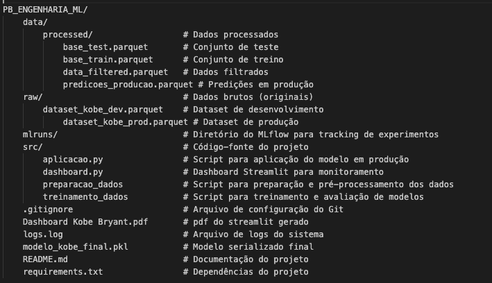
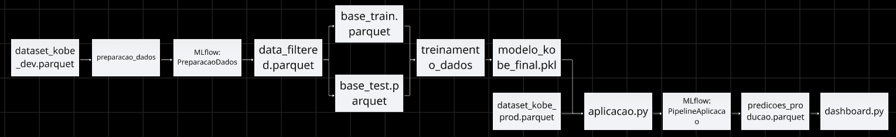
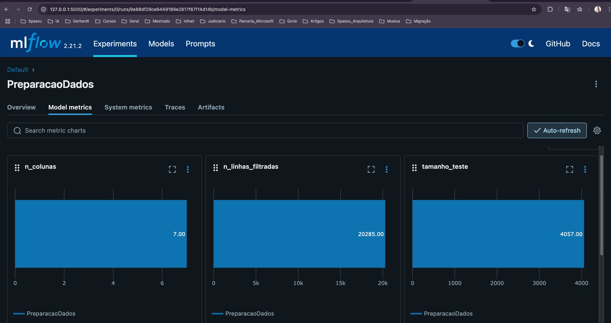
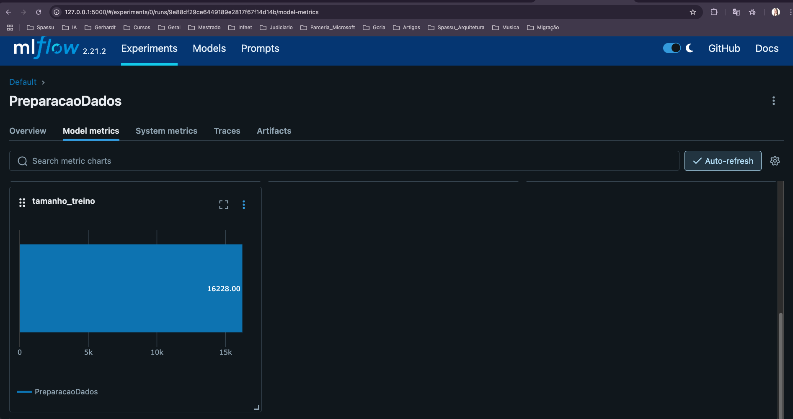
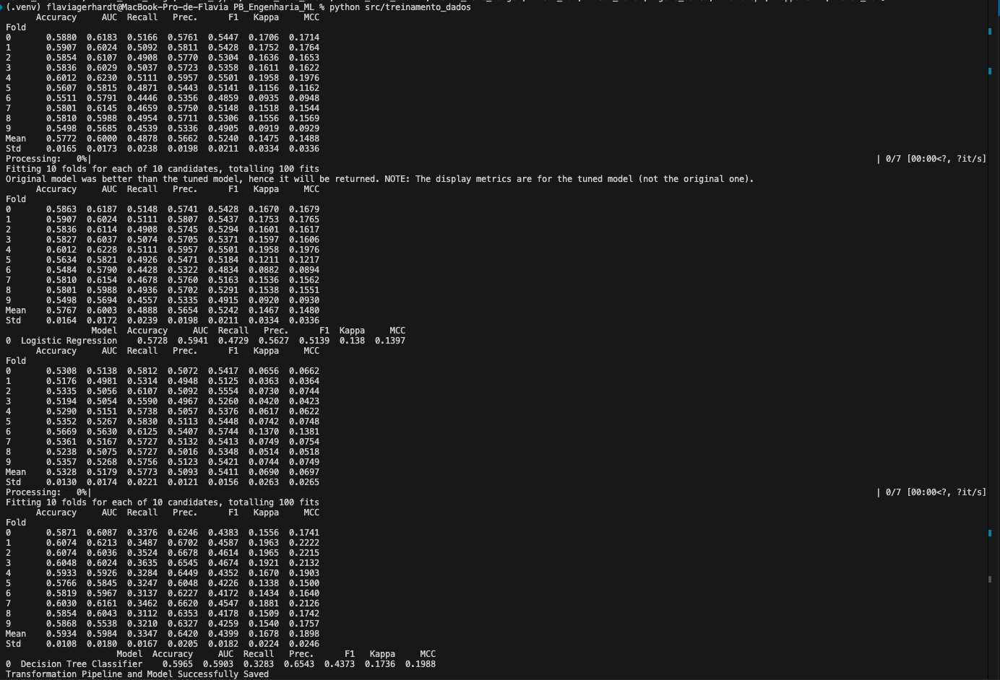
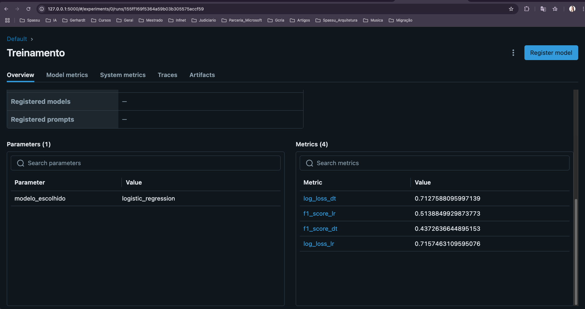
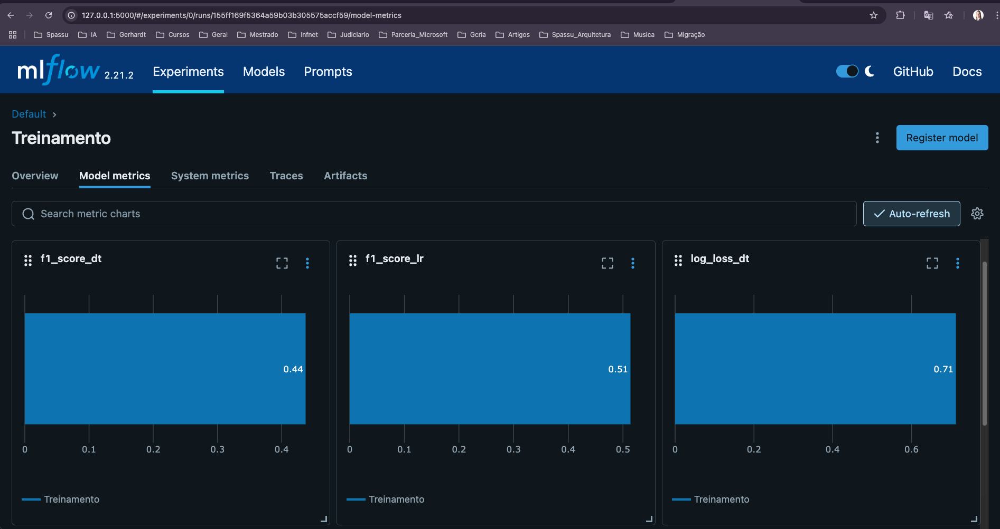
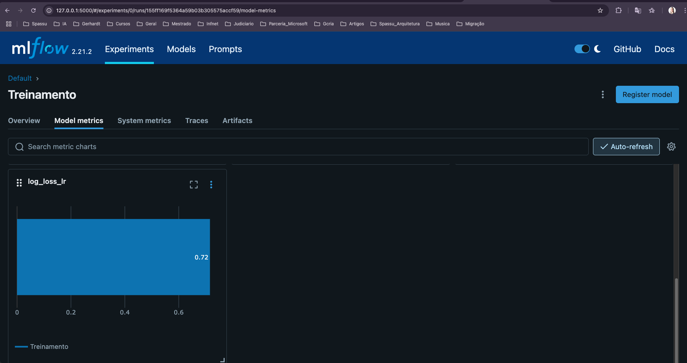
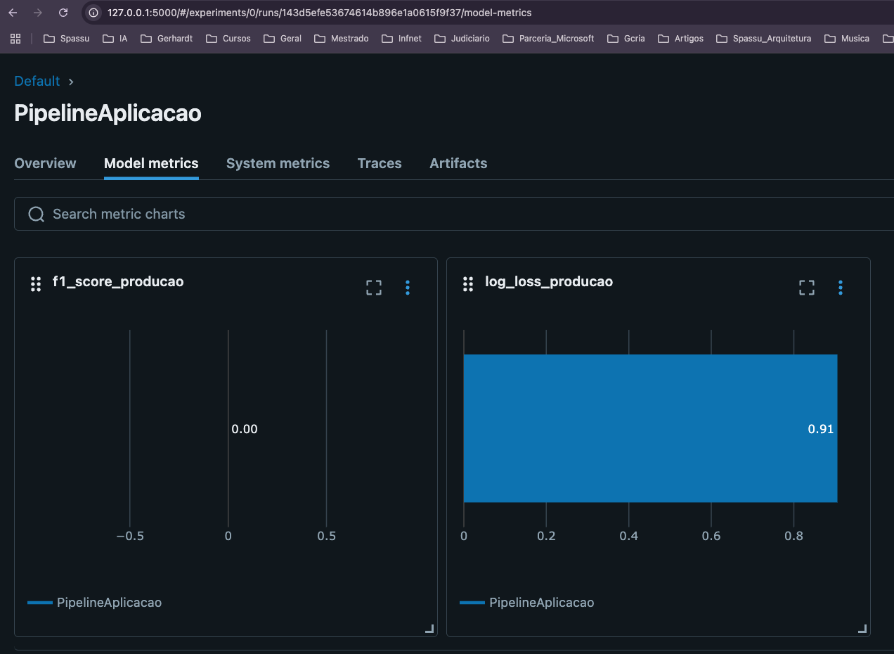

# Projeto: Preditor de Arremessos do Kobe Bryant

## Visão Geral

Projeto de Engenharia de Machine Learning para predição de arremessos de Kobe Bryant, utilizando PyCaret, MLflow, Scikit-Learn e Streamlit.
Desenvolvido com foco em MLOps, versionamento de experimentos, deploy de modelos e visualização de resultados.

## Como Executar o Projeto

### Pré-requisitos

Python 3.9+ instalado
Git instalado (para clonar o repositório, se necessário)
pip ou conda para instalar as dependências

### Configuração do Ambiente

1. Clone este repositório

git clone https://github.com/Flaviagerhardt/pb-engenharia-ml.git
cd pb-engenharia-ml

2. Crie um ambiente virtual (opcional, mas recomendado)

python -m venv venv
source venv/bin/activate  # Linux/macOS
venv\Scripts\activate     # Windows

3. Instale as dependências

pip install -r requirements.txt

### Execução do Pipeline

O projeto está estruturado em três etapas principais que devem ser executadas na seguinte ordem:

1. Preparação dos Dados
Este script carrega os dados brutos, realiza a limpeza, seleção de features e divide os dados em conjuntos de treino e teste.

-Navegue até o diretório do projeto
cd PB_Engenharia_ML

-Execute o script de preparação de dados
python src/preparacao_dados

Após a execução, os seguintes arquivos serão gerados:

data/processed/data_filtered.parquet: Dados filtrados
data/processed/base_train.parquet: Conjunto de treino
data/processed/base_test.parquet: Conjunto de teste

O MLflow registrará esta execução com o nome "PreparacaoDados".

2. Treinamento do Modelo

Este script treina dois modelos (regressão logística e árvore de decisão), compara suas performances e seleciona o melhor.

-Execute o script de treinamento
python src/treinamento_dados

Após a execução:

O modelo final será salvo como modelo_kobe_final.pkl
O MLflow registrará métricas como F1 Score e Log Loss para ambos os modelos
O run será nomeado como "Treinamento"

3. Aplicação em Produção

Este script aplica o modelo treinado em dados de produção.

-Execute o script de aplicação
python src/aplicacao.py

Após a execução:

As predições serão salvas em data/processed/predicoes_producao.parquet
Métricas de desempenho em produção serão registradas no MLflow

4. Monitoramento com Dashboard

Para visualizar os resultados e monitorar o desempenho do modelo:

-Execute o dashboard Streamlit
streamlit run src/dashboard.py

O dashboard será aberto automaticamente no seu navegador web padrão, geralmente em http://localhost:8501.

### Consulta de Experimentos no MLflow

Para visualizar os experimentos, métricas e artefatos registrados:

-Inicie a interface web do MLflow
mlflow ui

Acesse http://localhost:5000 no seu navegador para explorar:

Runs de preparação de dados
Comparações de modelos
Métricas de desempenho
Artefatos gerados

## Estrutura do Projeto

A estrutura a seguir representa a organização dos diretórios e arquivos do projeto, seguindo o framework TDSP (Team Data Science Process) da Microsoft.

## Descrição dos Componentes

### Diretórios de Dados
- **data/raw**: Armazena os dados brutos, sem nenhuma modificação.
  - `dataset_kobe_dev.parquet`: Dados de desenvolvimento para treinar o modelo.
  - `dataset_kobe_prod.parquet`: Dados de produção para aplicar o modelo.

- **data/processed**: Contém dados após processamento e transformações.
  - `data_filtered.parquet`: Dados após filtragem e limpeza.
  - `base_train.parquet`: Conjunto de dados de treino.
  - `base_test.parquet`: Conjunto de dados de teste.
  - `predicoes_producao.parquet`: Resultados das predições em produção.

### Código-fonte
- **src/**: Contém todos os scripts do projeto.
  - `preparacao_dados`: Script para processar os dados brutos.
  - `treinamento_dados`: Script para treinar e avaliar os modelos.
  - `aplicacao.py`: Script para aplicar o modelo em novos dados.
  - `dashboard.py`: Dashboard interativo para monitoramento.

### Artefatos e Configurações
- `modelo_kobe_final.pkl`: Modelo treinado e serializado.
- `requirements.txt`: Lista de dependências do projeto.
- `README.md`: Documentação do projeto.
- `mlruns/`: Diretório onde o MLflow armazena métricas, parâmetros e artefatos.

Esta estrutura segue boas práticas de organização de projetos de ciência de dados, separando claramente dados de código, e mantendo a rastreabilidade do processo através do MLflow.

## Pipeline de Machine Learning

Segue abaixo um diagrama de fluxo que mostra como os dados e processos se conectam, desde a preparação dos dados até a aplicação em produção e monitoramento, dividido em fases de desenvolvimento e produção.

### 1. Preparação de Dados
- **Objetivo**: Preparar os dados para treinamento do modelo.
- **Implementação**: Script `src/preparacao_dados`.
- **Processo**:
  - Carregamento dos dados brutos (dataset_kobe_dev.parquet)
  - Seleção de colunas relevantes: `lat`, `lon`, `minutes_remaining`, `period`, `playoffs`, `shot_distance`, `shot_made_flag`
  - Remoção de valores faltantes
  - Divisão em conjuntos de treino (80%) e teste (20%), estratificados pela variável alvo
  - Salva os dados processados em `data/processed/`

**Métricas registradas no MLflow**:
- Número de linhas filtradas: 20.285
- Número de colunas: 7
- Tamanho do conjunto de treino: 16.228
- Tamanho do conjunto de teste: 4.057
- Colunas selecionadas: 'lat', 'lon', 'minutes_remaining', 'period', 'playoffs', 'shot_distance', 'shot_made_flag'

### 2. Treinamento do Modelo
- **Objetivo**: Treinar e avaliar diferentes modelos para prever os arremessos.
- **Implementação**: Script `src/treinamento_dados`.
- **Modelos treinados**:
  1. **Regressão Logística**
     - Log Loss: 0,7157
     - F1 Score: 0,5139
  2. **Árvore de Decisão**
     - Log Loss: 0,7128
     - F1 Score: 0,4373
- **Modelo escolhido**: Regressão Logística (melhor F1 Score)
- **Armazenamento**: O modelo final é salvo utilizando PyCaret e registrado no MLflow para rastreamento.

### 3. Aplicação em Produção
- **Objetivo**: Aplicar o modelo treinado em dados de produção.
- **Implementação**: Script `src/aplicacao.py`.
- **Processo**:
  - Carregamento do modelo treinado
  - Carregamento e pré-processamento dos dados de produção
  - Geração de previsões
  - Cálculo de métricas de desempenho quando a variável alvo está disponível
  - Salva as previsões em `data/processed/predicoes_producao.parquet`

**Métricas registradas em produção**:
- Log Loss em produção: 0,9058
- F1 Score em produção: 0

### 4. Monitoramento
- **Objetivo**: Monitorar o desempenho do modelo em produção.
- **Implementação**: Dashboard interativo em `src/dashboard.py` usando Streamlit.
- **Funcionalidades**:
  - Visualização dos dados e previsões
  - Métricas de desempenho (Log Loss, F1 Score)
  - Gráficos de distribuição de acertos/erros por distância
  - Mapa de arremessos (visualização espacial)
  - Suporte para upload de novos arquivos de previsão

